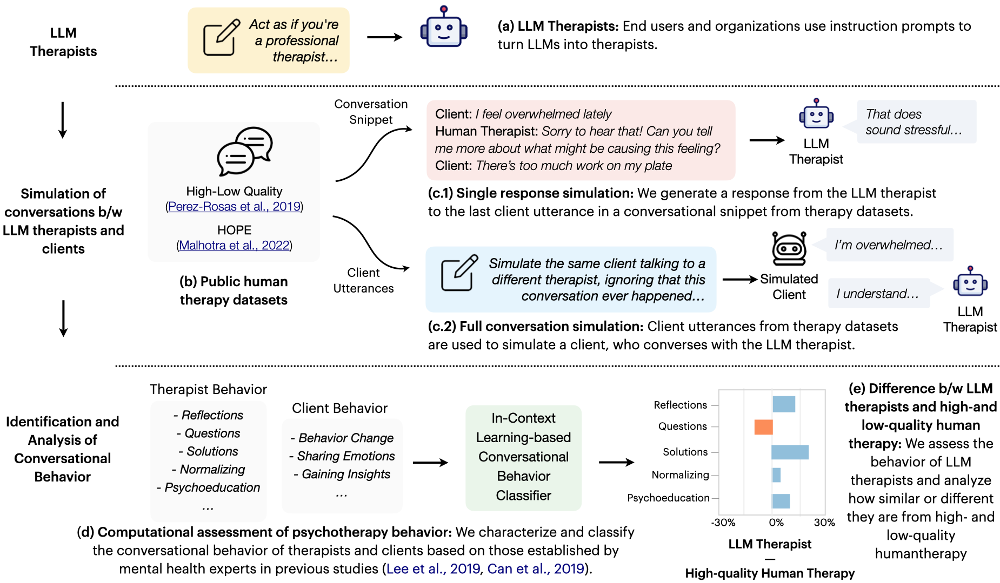

# BOLT

This repository contains the code and dataset for our [paper](https://arxiv.org/abs/2401.00820) on behavioral assessment of LLM therapists.


If this code or dataset helps you in your research, please cite the following publication:
```bash
@inproceedings{chiu2024bolt,
    title={A Computational Framework for Behavioral Assessment of LLM Therapists},
    author={Chiu, Yu Ying and Sharma, Ashish and Lin, Inna Wanyin and Althoff, Tim},
	journal={arXiv preprint arXiv:2401.00820},
	year={2024}
}
```


## Introduction
The emergence of ChatGPT and other large language models (LLMs) has greatly increased interest in utilizing LLMs as therapists to support individuals struggling with mental health challenges. However, due to the lack of systematic studies, our understanding of how LLM therapists behave, i.e., ways in which they respond to clients, is significantly limited. Understanding their behavior across a wide range of clients and situations is crucial to accurately assess their capabilities and limitations in the high-risk setting of mental health, where undesirable behaviors can lead to severe consequences. In this paper, we propose BOLT, a novel computational framework to study the conversational behavior of LLMs when employed as therapists.  We develop an in-context learning method to quantitatively measure the behavior of LLMs based on 13 different psychotherapy techniques including reflections, questions, solutions, normalizing, and psychoeducation. Subsequently, we compare the behavior of LLM therapists against that of high- and low-quality human therapy, and study how their behavior can be modulated to better reflect behaviors observed in high-quality therapy. Our analysis of GPT and Llama-variants reveals that these LLMs often resemble behaviors more commonly exhibited in low-quality therapy rather than high-quality therapy, such as offering a higher degree of problem-solving advice when clients share emotions, which is against typical recommendations. At the same time, unlike low-quality therapy, LLMs reflect significantly more upon clients' needs and strengths. Our analysis framework suggests that despite the ability of LLMs to generate anecdotal examples that appear similar to human therapists, LLM therapists are currently not fully consistent with high-quality care, and thus require additional research to ensure quality care.





## Quickstart

### 1. Prerequisites

Our code can be compiled on Python 3.9+ environments. First, create a new environment and install the required packages:
```
conda create -n bolt python=3.9
pip install -r requirements
```

This code uses OpenAI's python library. Please ensure that you set the `OPENAI_API_KEY` environment variable to your OpenAI API key. You can find your API key at [platform.openai.com/api-keys](https://platform.openai.com/api-keys).


### 2. Run Therapist Behavior Inference

A sample test file can be found at [dataset/sample_therapist_input.jsonl](dataset/sample_therapist_input.jsonl). To run the therapist behavior inference on this test file, run the following command:
```
python therapist_behavior_inference.py --method multi_label_w_def_and_ex --input_path dataset/sample_therapist_input.jsonl --output_path dataset/sample_therapist_output.jsonl
```

where `--method` specifies the method to use for therapist behavior inference. The following methods are available:

- `multi_label_w_def_and_ex`: multi-label classification with definitions of therapist behaviors as well as in-context examples
- `multi_label_w_def`: multi-label classification with definitions of therapist behaviors only
- `binary_label_w_def_and_ex`: binary classification with definitions of therapist behaviors as well as in-context examples


The output file will be saved at the path specified by `--output_path`. The output file will contain the `therapist_behavior` field, which contains the inferred therapist behaviors for each utterance.


### 3. Run Client Behavior Inference

A sample test file can be found at [dataset/sample_client_input.jsonl](dataset/sample_client_input.jsonl). To run the client behavior inference on this test file, run the following command:
```
python client_behavior_inference.py --method multi_label_w_def_and_ex --input_path dataset/sample_client_input.jsonl --output_path dataset/sample_client_output.jsonl
```

where `--method` specifies the method to use for client behavior analysis. The following methods are available:

- `multi_label_w_def_and_ex`: multi-label classification with definitions of client behaviors as well as in-context examples
- `multi_label_w_def`: multi-label classification with definitions of client behaviors only
- `binary_label_w_def_and_ex`: binary classification with definitions of client behaviors as well as in-context examples


The output file will be saved at the path specified by `--output_path`. The output file will contain the `client_behavior` field, which contains the inferred client behaviors for each utterance.
